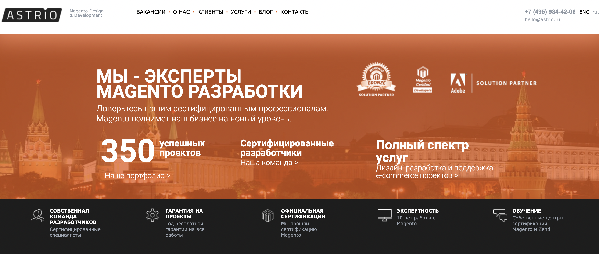
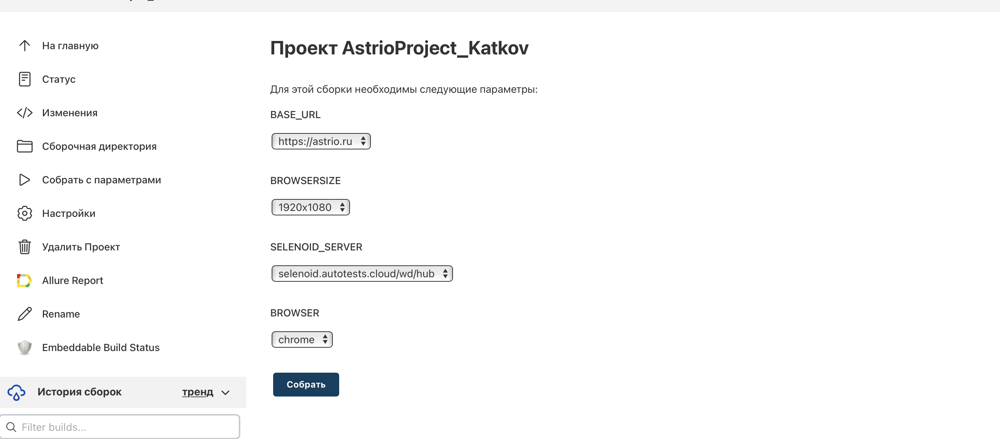
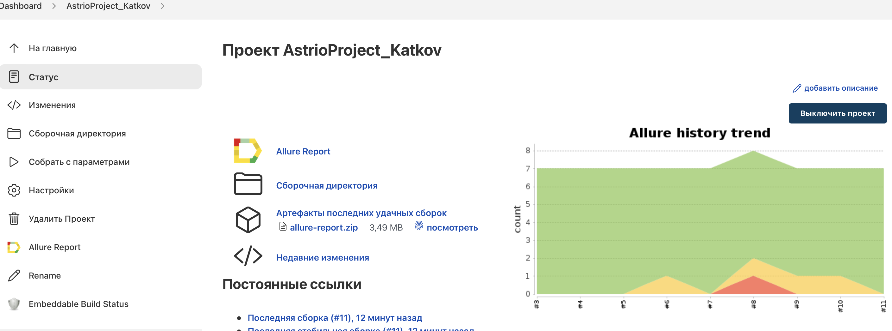
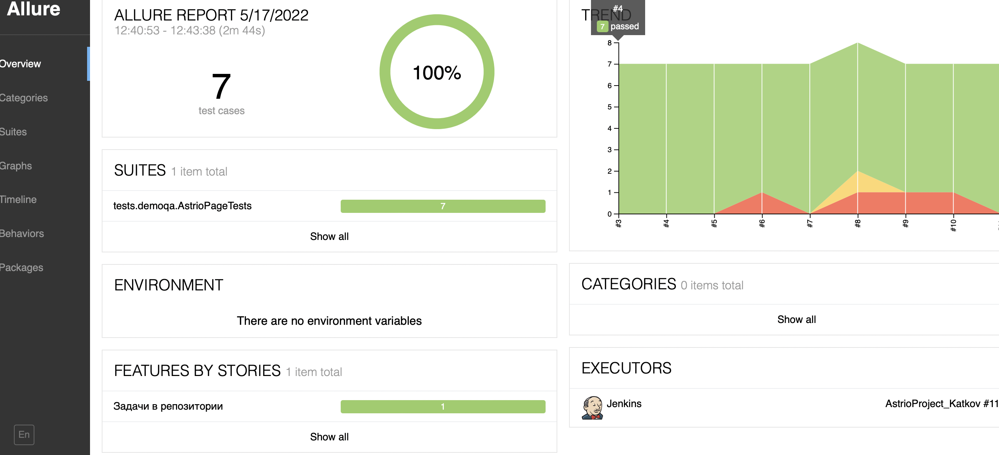
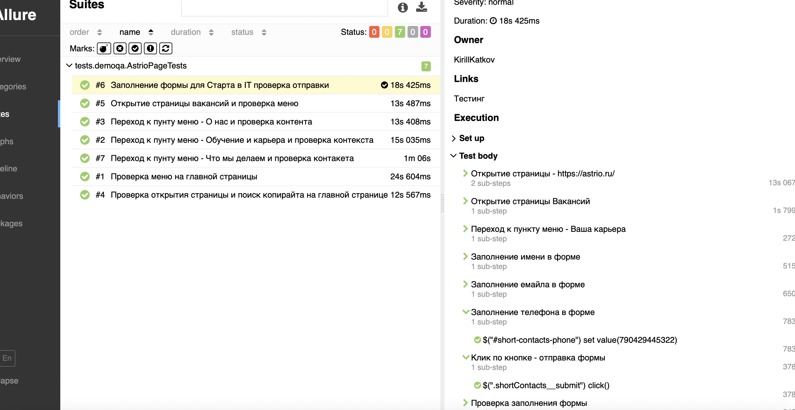
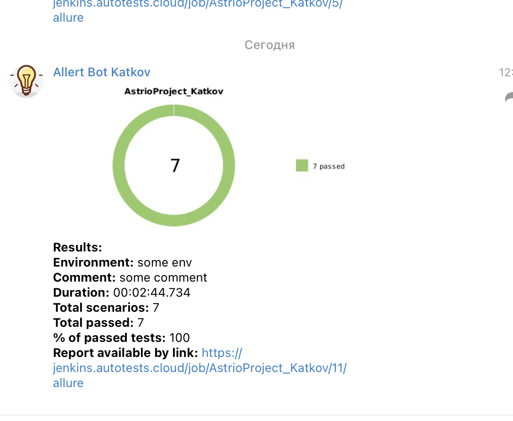
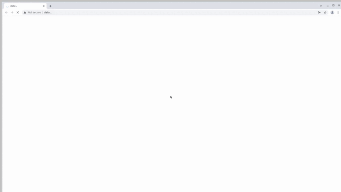

# Проект по автоматизации тестирования сайта "Аstrio"
## <a target="_blank" href="https://astrio.ru"> Аstrio - платформа по созданию интернет-магазинов на самых продвинутых e-commerce платформах в мире Magento Open Source и Magento Commerce</a>




## :floppy_disk: Содержание:

- <a href="#computer-технологии-и-инструменты">Технологии и инструменты</a>
- <a href="#notebook_with_decorative_cover-реализованные-проверки">Функционал и реализованные проверки</a>
- <a href="#electric_plug-сборка-в-Jenkins">Сборка в Jenkins</a>
- <a href="#arrow_forward-запуск-из-терминала">Запуск из терминала</a>
-  <a href="#remote_start-запуск-из-терминала">Удаленный запуск тестов</a>
- <a href="#open_book-allure-отчет">Allure отчет</a>
- <a href="#robot-отчет-в-telegram">Отчет в Telegram</a>
- <a href="#film_projector-видео-примеры-прохождения-тестов">Видео примеры прохождения тестов</a>

## :computer: Технологии и инструменты
<p align="center">


</p>

## :notebook_with_decorative_cover: Реализованные проверки
- Проверка копирайта на главной странице
- Проверка открытия страницы вакансий и меню
- Проверка контента на странице "О нас"
- Проверка контента на странице "Обучение и карьера"
- Проверка контента на странице "Что мы делаем"
- Проверка заполнения формы "для старта в IT"

## :electric_plug: Сборка в Jenkins
### <a target="_blank" href="https://jenkins.autotests.cloud/job/AstrioProject_Katkov/build?delay=0sec">Сборка с параметрами в Jenkins</a>
<p align="center">

</p>  

### <a target="_blank" href="https://jenkins.autotests.cloud/job/AstrioProject_Katkov/build?delay=0sec">Архив Сборок в Jenkins</a>
<p align="center">

</p>  

## :arrow_forward: Запуск из терминала
Локальный запуск:
```
gradle clean test
```

Удаленный запуск:
```
clean
astrio
 -DbaseUrl=${BASE_URL}
 -Dbrowser=${BROWSER}
 -Dbrowsersize=${BROWSERSIZE}
 -Dselenoid_server=${SELENOID_SERVER}
```
:monocle_face: Расшифровка параметров сборки!

- -DbaseUrl - можно выбрать базовый адрес на котором будут проходить тесты
- -Dbrowser - можно выбрать необходимый браузер,(chrome,
  opera,
  firefox)
- -Dbrowsersize - возможность упралять разрешением (1920x1080,
  1366×768, 1536х864)
- -Dselenoid_server - возможность выбрать сервер для запуска тестов

## :open_book: Allure отчет
- ### Главный экран отчета
<p align="center">

</p>

- ### Страница с проведенными тестами
<p align="center">

</p>


## :robot: Отчет в Telegram
<p align="center">

</p>

## :film_projector: Видео примеры прохождения тестов
> После каждого прохождения теста будет доступно видео. Один из примеров ниже:
<p align="center">
  
</p>